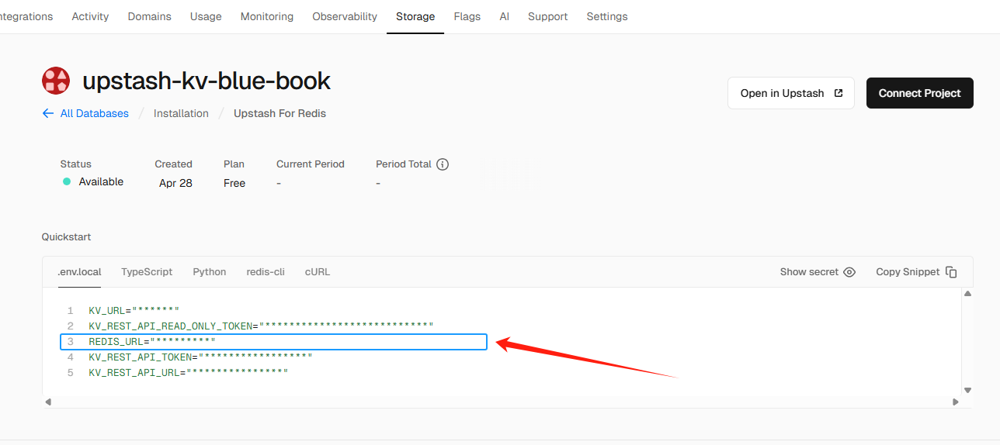

# How to Deploy to Vercel
If you'd like to quickly try out TinaCMS, you can click [here](https://vercel.com/new/git/external?repository-url=https://github.com/IKKEM-Lin/tina-self-hosted-template/tree/main&env=GITHUB_PERSONAL_ACCESS_TOKEN,REDIS_URI,NEXTAUTH_SECRET&envDescription=NEXTAUTH_SECRET%20is%20secret%20for%20tinacms-auth.%20For%20the%20other%20variables%2C%20you%20can&envLink=https://github.com/IKKEM-Lin/tina-self-hosted-template/tree/main/doc/VercelDeploy.md) to quick deploy to Vercel with one click. To successfully complete the deployment, you’ll need to configure the following three environment variables:

## 1. GITHUB_PERSONAL_ACCESS_TOKEN
First, make sure you're logged into Vercel with your GitHub account. TinaCMS performs Git operations, such as git push, when saving content changes. This template automatically reads the [GitHub Owner, Repo, and Branch](https://github.com/IKKEM-Lin/tina-self-hosted-template/blob/main/tina/gitProvider/index.ts#L15-L16) information from your Vercel environment variables.
To authorize these operations, you’ll need to provide a [GitHub Personal Access Token](https://github.com/settings/personal-access-tokens/new) with the appropriate repository access permissions. For details, refer to the [GitHub Git Provider](https://tina.io/docs/reference/self-hosted/git-provider/github).

## 2. REDIS_URI
During both build and runtime, TinaCMS requires a database to index and sort documents. You can create a free `Upstash Redis` instance through Vercel's Storage integration and retrieve the Redis URL to use as this variable's value. For more information, see the [Database Adapter](https://tina.io/docs/reference/self-hosted/database-adapter/overview).

## 3. NEXTAUTH_SECRET
This is a secret key used by TinaCMS with `tinacms-authjs` for authentication. You can use any random string. For details, refer to the [Auth Provider](https://tina.io/docs/reference/self-hosted/auth-provider/authjs#update-tina-backend).